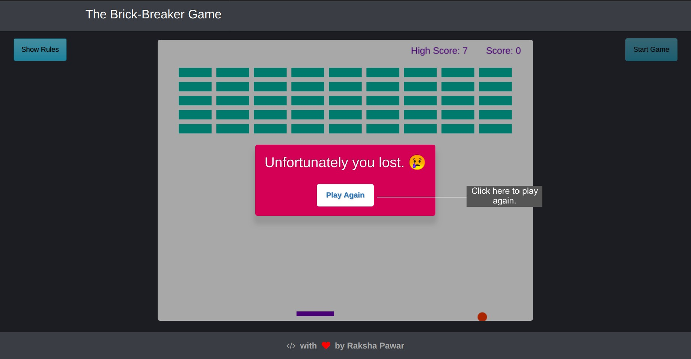

## Brick-Breaker-Game
A simple Brick Breaker Game using Vanilla JS.

Game Canvas and Animation is made using HTML5 Canvas API.
* Run 'index.html' to see and play the game.
* Click on 'Start Game' button to start the gameplay.
* Click on 'Show Rules' button to know the rules of the game and How to play.
* High score will be stored in local storage of your browser.

**This game is not mobile responsive, therefore play it on a laptop for better experience.**

### Screenshots

Game Screen

Rules Sidebar

Gameplay

Lost

